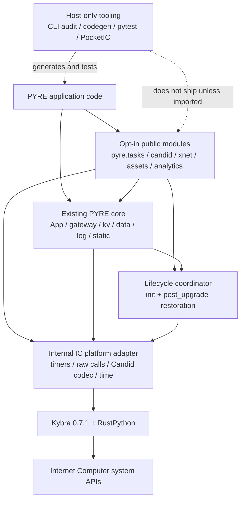
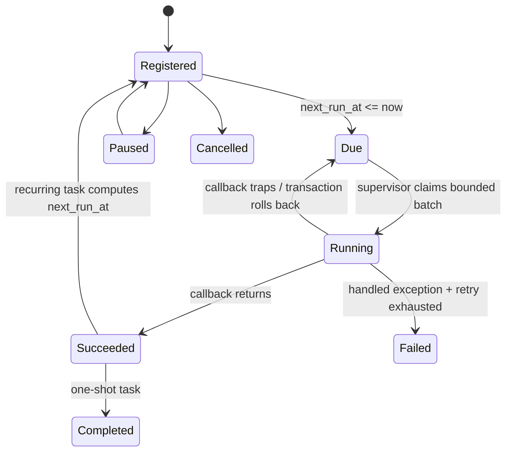

# PYRE vNext Extension Requirements and Technical Specification

**Status:** Implementation-ready draft  
**Baseline:** `pyre-icp` 1.2.1, current `main` branch, Kybra 0.7.1, Python 3.10.7 build toolchain  
**Target:** A sequence of backward-compatible vNext releases; no version number is assigned by this document  
**Audience:** Codex implementation agent, PYRE maintainers, reviewers, and release engineering  
**Prepared:** July 10, 2026  
**Primary input:** *Strategic Expansion of the PYRE Framework: Ecosystem Analysis and Module Architecture on the Internet Computer*

---

## How to use this document

This is a build specification, not a product brainstorm. Codex should implement it as a series of small pull requests in the phase order defined below. Every normative requirement uses **MUST**, **SHOULD**, or **MAY**:

- **MUST** is required for acceptance.
- **SHOULD** is expected unless a written technical reason is added to `DECISIONS.md`.
- **MAY** is optional and must not delay the phase.

Codex must not implement all modules in one change. Each phase must preserve current behavior, pass the existing test and budget gates, and include its own tests, documentation, measurements, and migration notes.

---

## 1. Executive summary

PYRE is a Flask-flavored Python framework for Internet Computer canisters. It currently provides HTTP routing, certified query responses, stable-memory collections, validation and authentication, deterministic HTTPS outcalls, safe randomness and time, cryptography and threshold signing, OIDC, SPA/static serving, adapters, logging, local development, and deployment-oriented CLI tooling. It runs on Kybra/RustPython inside WebAssembly rather than CPython on a conventional server.

The expansion report correctly identifies the next major developer-experience gaps: persistent background work, high-level cross-canister calls and Candid handling, reusable PocketIC testing, generalized large-asset streaming, dependency compatibility auditing, and lightweight on-chain analytics. The live v1.2.1 codebase changes two implementation assumptions from the report:

1. PYRE already has chunked stable-memory static assets and an `assets push` protocol. The new asset work must refactor and extend that implementation rather than create a parallel store.
2. The repository already has unit, end-to-end, budget, and internal PocketIC tests. The testing work should expose a supported public harness and fixtures rather than invent a separate testing stack.

The recommended delivery order is:

1. Foundation: lifecycle coordination, platform adapters, namespaces, and budget baselines.
2. Public testing harness and dependency audit command.
3. Persistent background tasks.
4. Candid code generation and cross-canister client.
5. Generalized asset store and HTTP streaming.
6. Experimental pure-Python analytics.

This order gives Codex a safety net before implementing stateful or cross-canister behavior and keeps the highest-risk, largest-footprint feature - analytics - behind an explicit experimental gate.

---

## 2. Current-state baseline

### 2.1 Product baseline

The implementation must assume the following current public surface and preserve it:

| Area | Current capability in 1.2.1 | vNext rule |
|---|---|---|
| HTTP | `App`, `Request`, `Response`, routes, hooks, CORS, error handlers | No behavioral regression |
| Certification | Certified route snapshots and recertification | Lifecycle refactor must still recertify on install and upgrade |
| Persistence | `pyre.kv` and `pyre.data` on one bound `StableBTreeMap` | New framework state uses reserved key prefixes, not new memory IDs by default |
| Validation/auth | Schema validation and authentication middleware | Reuse existing error and security conventions |
| Outcalls | `pyre.compat.urllib_request`, transforms, response caps | Tasks and xnet must respect update context and deterministic execution |
| Safe platform APIs | `pyre.random`, `pyre.uuid`, `pyre.time`, `pyre.crypto`, `pyre.sign` | No stdlib entropy or wall-clock fallbacks in canister code |
| Identity | `pyre.oidc` | No change required |
| Static assets | `pyre.static`, chunked storage, manifest/chunk/finalize upload, `pyre assets push` | Refactor into shared asset storage; preserve existing keys and routes |
| Integrations | Supabase and Upstash adapters | No change required |
| Observability | Structured logging | New modules emit structured events through the existing logger |
| Tooling | `pyre new`, `pyre dev`, `pyre assets push` | Add commands without changing existing flags or output contracts unnecessarily |
| Quality gates | Unit, E2E, PocketIC, instruction/size/idle budget gates | Every phase must use the same gates and add feature-specific coverage |

### 2.2 Execution constraints

The following constraints are architectural, not temporary implementation details:

- Canister code executes under RustPython/Kybra in WebAssembly. Host CPython is a build and development tool.
- Core canister features MUST be pure Python or explicitly backed by a reviewed Wasm-compatible Rust/Kybra primitive.
- Packages that require CPython C extensions MUST be treated as incompatible unless a measured, supported Wasm path exists.
- Query handlers MUST NOT mutate stable state or make outbound/cross-canister calls.
- Update calls can suspend for outbound work; code across an `await`/yield boundary is not one atomic distributed transaction.
- Inter-canister request and reply payloads MUST be guarded below the protocol limit. The default PYRE guard is 1,900,000 bytes to preserve envelope headroom.
- Timer identifiers are runtime handles and MUST NOT be treated as durable state across upgrades.
- Framework modules are bundled with application modules. Generic Python basenames can collide under Kybra's bundling behavior; every new framework basename MUST be added to the reserved-name scanner.
- Wasm size, instruction use, idle burn, and stable-memory growth MUST be measured. Do not hard-code a single protocol module-size constant as the only gate; use the repository's actual deploy and budget checks.

### 2.3 Existing implementation details that vNext must reuse

- `pyre._runtime` already detects RustPython and stores query/update dispatch context.
- `pyre.kv` already owns stable memory ID 250 through the generated canister entrypoint and limits JSON values to 64,000 bytes.
- `pyre.static` already stores raw and gzip variants in 45,000-byte raw chunks, with idempotent upload and atomic finalization.
- The generated `main.py` already declares the Internet Computer HTTP streaming Candid types, but PYRE does not currently return a streaming strategy or implement a streaming callback.
- `main.py` currently calls `app.recertify()` in both `init` and `post_upgrade`. vNext must preserve this behavior while allowing other framework subsystems to restore themselves.
- The CLI already scans user source for reserved basenames and nondeterminism footguns.

---

## 3. Goals and non-goals

### 3.1 Goals

- Make autonomous, upgrade-safe work easy to define and inspect.
- Make cross-canister calls readable, typed where possible, and explicit about failure and payload limits.
- Give application developers a supported `pytest`/PocketIC experience with minimal boilerplate.
- Extend static serving into a reusable, resumable, stream-capable asset system without breaking current SPAs.
- Detect dependency and bundling incompatibilities before a Kybra build or deployment.
- Provide a bounded, deterministic tabular API for modest on-chain datasets without pretending to be NumPy or pandas.
- Preserve PYRE's current low-dependency, deterministic, security-first philosophy.

### 3.2 Non-goals

- Full CPython, NumPy, pandas, Polars, or arbitrary C-extension compatibility.
- A distributed Celery clone, general-purpose message broker, or exactly-once task execution.
- Transparent retries of arbitrary cross-canister updates.
- Runtime downloading of untrusted `.did` files from remote canisters.
- A second static asset store that duplicates `pyre.static`.
- Certified streaming of arbitrary large private media in the first asset milestone.
- A new event loop, threads, sockets, or background operating-system processes inside a canister.
- Breaking changes to current routes, stable keys, generated project templates, or CLI commands without a documented migration.

---

## 4. Architecture and design rules

### 4.1 Layered design



### 4.2 Required architectural decisions

| ID | Requirement |
|---|---|
| ARCH-001 | New feature modules MUST be opt-in. `pyre.__init__` MUST NOT eagerly import heavy vNext modules. Explicit `from pyre import tasks` or `import pyre.tasks` should load only that module. |
| ARCH-002 | New physical module basenames (`tasks`, `candid`, `xnet`, `testing`, `assets`, `analytics`) MUST be added to the CLI's reserved basename set. |
| ARCH-003 | Direct Kybra imports MUST be isolated behind an internal platform adapter except where Kybra's static analysis requires declarations in generated `main.py`. Host tests must be able to replace this adapter. |
| ARCH-004 | Install and upgrade behavior MUST pass through one lifecycle coordinator. The coordinator MUST call `app.recertify()` and then restore registered subsystems in deterministic order. |
| ARCH-005 | Framework-owned stable keys MUST use `__pyre:<subsystem>:<schema-version>:` prefixes. Public APIs MUST never expose raw framework keys. |
| ARCH-006 | No subsystem may allocate another `StableBTreeMap` memory ID in the default template without a written decision and migration analysis. Use the existing `pyre.kv` backend first. |
| ARCH-007 | Every persisted record MUST contain a schema version and have a documented migration path. Unknown future versions MUST fail closed with a descriptive error. |
| ARCH-008 | New modules MUST use PYRE's existing query/update honesty guards and error conventions. |
| ARCH-009 | Host-only dependencies MUST be optional and MUST NOT become required runtime dependencies of a basic PYRE app. |
| ARCH-010 | Any feature that materially increases bundle size MUST remain unimported by default and must publish a measured size delta. |
| ARCH-011 | Public APIs MUST use deterministic ordering where results can be compared across replicas. |
| ARCH-012 | No feature may claim exactly-once execution, atomicity across awaits, or security certification that the IC/PYRE implementation does not provide. |

### 4.3 Lifecycle coordinator

The generated canister entrypoint should become conceptually equivalent to:

```python
from kybra import init, post_upgrade, void
from pyre._lifecycle import run_init, run_post_upgrade
from app import app

@init
def pyre_init() -> void:
    run_init(app)

@post_upgrade
def pyre_post_upgrade() -> void:
    run_post_upgrade(app)
```

The coordinator MUST:

1. Re-certify the application exactly as current templates do.
2. Restore tasks and other registered subsystems after stable memory has been bound.
3. Run hooks in deterministic `(order, name)` order.
4. Prevent duplicate registration by name.
5. Log a structured success/failure event per hook.
6. Trap on a required hook failure; optional hooks may log and continue only when explicitly registered as optional.
7. Be host-testable without importing Kybra.

---

## 5. Delivery roadmap

| Phase | Deliverables | Exit condition |
|---|---|---|
| 0 - Foundation | Lifecycle coordinator, platform adapter, reserved names, namespace helpers, baseline measurements | Existing behavior unchanged; all current gates green |
| 1 - Safety net | `pyre.testing` public harness, pytest fixtures, PocketIC wrapper, `pyre audit` | New features can be tested in host and canister modes; audit emits stable JSON |
| 2 - Autonomous work | `pyre.tasks` persistent scheduler | Tasks survive upgrade simulation and enforce overlap/catch-up policy |
| 3 - Canister orchestration | Candid parser/codegen plus `pyre.xnet` | Generated clients call test canisters through PocketIC with typed errors |
| 4 - Generalized assets | `pyre.assets`, shared chunk store, resumable sessions, HTTP streaming callback | Existing static tests pass; >1.8 MB asset streams in PocketIC/gateway test |
| 5 - Analytics experiment | Candidate evaluation and bounded `pyre.analytics.Table` | Size/performance gate passes and API is explicitly experimental |

Phases 1A (`testing`) and 1B (`audit`) may be separate pull requests. No later phase should merge until its prerequisite phase is released or available on the integration branch.

---

## 6. Phase 0 - Foundation requirements

### 6.1 Internal platform adapter

Create an internal adapter, recommended as `pyre/_platform.py`, with interfaces for:

- `in_canister()` and dispatch context access (delegating to `pyre._runtime`).
- `now_ns()` using consensus-safe IC time in-canister and an injectable host clock in tests.
- `set_timer(delay_ns, callback)`, `clear_timer(handle)`, and optionally interval timers.
- `call_raw(canister_id, method, payload, cycles=0)`.
- `notify_raw(...)`.
- `candid_encode(text)` and `candid_decode(payload)`.
- `log_debug(message)` or delegation to the existing logger.

Requirements:

| ID | Requirement |
|---|---|
| FND-001 | Importing `pyre` on CPython MUST NOT import Kybra. |
| FND-002 | Platform operations that are unavailable on the host MUST raise a specific `PlatformUnavailable` error unless a test adapter is installed. |
| FND-003 | Tests MUST be able to install a fake adapter with deterministic time, timers, calls, and rejections. |
| FND-004 | The adapter MUST not hide query/update restrictions or automatically change a route's execution mode. |
| FND-005 | The adapter API MUST use plain Python types at its boundary so feature modules remain independently unit-testable. |

### 6.2 Framework namespace helper

Create an internal helper for stable keys:

```python
key = framework_key("tasks", schema=1, kind="record", identity="refresh_prices")
# __pyre:tasks:1:record:refresh_prices
```

It MUST validate key lengths, escape identities deterministically, prevent `:` ambiguity, and include utilities for listing/deleting a subsystem prefix without touching application keys.

### 6.3 Baseline records

Before feature implementation, update `DECISIONS.md` with:

- Current compressed and uncompressed Wasm sizes for each existing example.
- Current instruction counts for representative query and update routes.
- Current idle burn measurement.
- Current wheel/sdist size.
- Current unit, PocketIC, and E2E test counts and duration.

These measurements are the comparison baseline for all later phases.

---

## 7. `pyre.candid` - Candid interface support

### 7.1 Product decision

The report proposes loading and parsing arbitrary `.did` files at canister runtime. vNext retains dynamic parsing as a long-term capability, but the **MVP MUST prefer host-side code generation**. Build-time parsing produces smaller, reviewable, deterministic canister code and avoids paying for the full grammar/parser in every Wasm bundle.

Two layers are required:

1. A host-side parser and generator used by `pyre candid generate`.
2. A lightweight runtime service specification used by generated clients and `pyre.xnet`.

A runtime `ServiceSpec.from_did(text)` MAY ship later only if size and instruction measurements pass.

### 7.2 CLI

```bash
pyre candid generate interfaces/icrc1.did \
  --name LedgerService \
  --output src/generated/icrc1_service.py

pyre candid check interfaces/icrc1.did
```

The generator MUST produce deterministic output. Running it twice with identical input and tool version must produce byte-identical files.

### 7.3 Runtime API

Generated output should expose a small immutable specification:

```python
from generated.icrc1_service import LedgerService
from pyre import xnet

ledger = xnet.CanisterClient(
    canister_id="ryjl3-tyaaa-aaaaa-aaaba-cai",
    service=LedgerService,
)

balance = await ledger.call(
    "icrc1_balance_of",
    {"owner": request.caller, "subaccount": None},
)
```

The runtime Candid layer SHOULD expose:

```python
from pyre.candid import ServiceSpec, MethodSpec, TypeSpec, CandidError
```

### 7.4 Supported grammar

| Type/construct | MVP | Notes |
|---|---:|---|
| `null`, `bool`, `text`, `principal`, `blob` | Yes | Map to Python `None`, `bool`, `str`, principal string/type, and `bytes` |
| `nat`, `int`, fixed-width numbers, floats | Yes | Enforce bounds before encoding |
| `opt T` | Yes | Python `None` or value |
| `vec T` | Yes | `list[T]`; `vec nat8` may use `bytes` |
| records and tuples | Yes | Dicts by default; generated `TypedDict`-style hints on host |
| variants | Yes | Canonical one-key dict representation |
| aliases | Yes | Resolve with cycle detection |
| service methods, query annotations, oneway | Yes | Preserve method mode in `MethodSpec` |
| recursive types | Parse/check; runtime support P2 | Reject unsupported cycles with exact source location |
| function and service values | P2 | Method definitions are supported; arbitrary first-class values may be rejected |
| imports/includes/extensions outside standard Candid | No | Fail with actionable diagnostics |

### 7.5 Requirements

| ID | Requirement |
|---|---|
| CAN-001 | The parser MUST report line, column, token, and expected construct for syntax errors. |
| CAN-002 | The parser MUST enforce configurable maximum source size, nesting depth, field count, and alias depth to prevent resource exhaustion. |
| CAN-003 | Generated files MUST contain the source SHA-256 and generator version. |
| CAN-004 | Generated code MUST not import host-only parser modules in-canister. |
| CAN-005 | The runtime MUST use Kybra's Candid encode/decode primitives where viable rather than implementing an unreviewed binary codec from scratch. |
| CAN-006 | Python-to-Candid conversion MUST validate integer bounds, required record fields, unknown fields, variant shape, and vector element types before making a call. |
| CAN-007 | Decoding MUST reject malformed or unexpected responses with a `CandidDecodeError` that names the method and expected type. |
| CAN-008 | Field and method ordering in generated output MUST be deterministic. |
| CAN-009 | The generator MUST be covered by golden tests using representative public `.did` fixtures, including nested records, variants, opts, vectors, and aliases. |
| CAN-010 | The parser/generator license and any borrowed grammar must be documented. No unreviewed copy of `ic-py` may be pasted into PYRE. |

### 7.6 Acceptance tests

- Parse and generate a minimal service, ICRC-1-style service, nested variant service, and intentionally invalid fixtures.
- Round-trip valid arguments through the host codec or a test adapter.
- Use generated service metadata in PocketIC to call a fixture canister.
- Verify deterministic generation in CI by regenerating and checking a clean Git diff.
- Measure the generated client's Wasm delta independently from the host parser, which must not be bundled.

---

## 8. `pyre.xnet` - Cross-canister client

### 8.1 Public API

```python
from pyre import xnet
from generated.counter_service import CounterService

counter = xnet.CanisterClient(
    canister_id="aaaaa-aa",
    service=CounterService,
    max_payload_bytes=1_900_000,
)

result = await counter.call("increment", 1)
current = await counter.call("get")
```

Recommended signatures:

```python
class CanisterClient:
    def __init__(self, canister_id, service, *, default_cycles=0,
                 max_payload_bytes=1_900_000, transport=None): ...

    async def call(self, method, *args, cycles=None, timeout=None): ...
    def notify(self, method, *args, cycles=None): ...
    def method(self, name): ...
```

`timeout` is a logical client/test timeout; the canister implementation MUST not pretend it can cancel an IC message that is already sent.

### 8.2 Failure model

Expose stable exceptions:

- `XNetError` base class.
- `UnknownMethod`.
- `QueryContextCallError`.
- `CandidEncodeError` / `CandidDecodeError`.
- `PayloadTooLarge` with actual and allowed byte counts.
- `CanisterRejected` with reject code and sanitized message.
- `CallTransportError` for platform-level failures.

### 8.3 Requirements

| ID | Requirement |
|---|---|
| XNET-001 | Calls MUST validate the target principal/canister identifier before encoding. |
| XNET-002 | The client MUST reject cross-canister calls from query context before contacting the platform. Composite-query support is a separate P2 feature. |
| XNET-003 | Encoded requests MUST be measured before send and rejected above `max_payload_bytes`. Replies MUST be measured before decode when the adapter exposes their size. |
| XNET-004 | `call()` MUST use the method signature from the supplied service specification. Dynamic unknown methods are rejected by default. |
| XNET-005 | The client MUST NOT automatically retry update calls. A future retry helper may require an explicit idempotency policy. |
| XNET-006 | `notify()` MUST be clearly documented as fire-and-forget with no reply guarantee. It MUST require an explicit call rather than a flag on `call()`. |
| XNET-007 | Cycles payment MUST be explicit and default to zero. Refunded cycles, when available, SHOULD be included in result metadata or logs. |
| XNET-008 | User-facing rejection messages MUST be length-limited before logging or returning. |
| XNET-009 | The implementation MUST document that work before and after an await is not one atomic cross-canister transaction. |
| XNET-010 | A replaceable transport interface MUST support a fake unit-test transport and PocketIC transport. |
| XNET-011 | The first release MUST support update calls. Query/composite-query optimization MAY follow after Kybra and replica behavior are verified. |

### 8.4 Test matrix

- Successful no-argument and structured-argument calls.
- Nested variant response.
- Remote rejection and malformed response.
- Request and reply size guards.
- Query-context rejection.
- Explicit cycles payment.
- Notify path.
- Two-canister PocketIC test showing state mutation and a subsequent read.
- Non-atomicity example in documentation and tests where a remote call succeeds but local post-call validation fails.

---

## 9. `pyre.tasks` - Persistent background tasks

### 9.1 Public API

```python
from pyre import tasks

@tasks.every(
    seconds=300,
    name="refresh_prices",
    overlap="skip",
    catch_up="run_once",
)
async def refresh_prices():
    # May use PYRE outcalls or xnet because timer callbacks execute as updates.
    ...

@tasks.after(seconds=30, name="warm_cache_once")
def warm_cache_once():
    ...
```

Programmatic controls:

```python
tasks.pause("refresh_prices")
tasks.resume("refresh_prices")
tasks.cancel("warm_cache_once")
tasks.run_now("refresh_prices")
tasks.status("refresh_prices")
tasks.list()
```

A five-field UTC cron expression MAY be added after interval and one-shot scheduling are complete. The MVP API should reserve `@tasks.cron(...)` but need not expose it until semantics and parser footprint are approved.

### 9.2 Scheduling model

The scheduler SHOULD use one framework supervisor wake-up rather than persist one raw native timer ID per task:



Durable records store scheduling intent and status. Native timer handles are ephemeral and are recreated on install, post-upgrade, and whenever the earliest due time changes. A periodic safety sweep MAY be used to recover from a missed wake-up.

### 9.3 Durable schema

Each task record MUST contain at least:

| Field | Purpose |
|---|---|
| `schema` | Record schema version |
| `name` | Stable task identity; unique within one canister |
| `kind` | `interval` or `once` in MVP |
| `interval_ns` / `run_at_ns` | Schedule definition |
| `next_run_at_ns` | Durable next target time |
| `enabled` | Pause/resume state |
| `overlap` | `skip`, `queue_one`, or `allow` |
| `catch_up` | `skip` or `run_once` |
| `state` | `scheduled`, `running`, `completed`, `failed`, `cancelled` |
| `last_started_at_ns` | Observability |
| `last_finished_at_ns` | Observability |
| `last_success_at_ns` | Observability |
| `run_count` / `failure_count` | Counters |
| `last_error` | Truncated sanitized message |
| `definition_hash` | Detect code/schedule changes across upgrade |

The Python callback itself is registered in code and is not serialized. A stable task name is the join key between durable state and current code.

### 9.4 Delivery semantics

- PYRE MUST state that task execution is **not exactly once**.
- Callback code SHOULD be idempotent because a trap, upgrade boundary, or remote side effect may cause a later retry or duplicate observable effect.
- The default overlap policy is `skip`.
- The default catch-up policy after downtime/upgrade is `skip`; `run_once` runs one immediate catch-up, never one invocation per missed interval.
- Interval duration is a minimum target, not a real-time guarantee.
- The supervisor MUST process a bounded number of due jobs and bounded instructions per wake-up, then reschedule remaining work.

### 9.5 Requirements

| ID | Requirement |
|---|---|
| TASK-001 | Task names MUST be explicit or deterministically derived and unique. Duplicate names fail at import/registration time. |
| TASK-002 | The scheduler MUST persist durable state under `__pyre:tasks:1:` using `pyre.kv`. |
| TASK-003 | `post_upgrade` MUST rebind definitions, migrate records, compute catch-up behavior, and schedule the next supervisor wake-up. |
| TASK-004 | Raw timer IDs MUST never be persisted. |
| TASK-005 | A task definition removed from code MUST be marked `orphaned` and not executed. It must remain inspectable until explicitly purged. |
| TASK-006 | Renaming a task MUST require an explicit migration alias, for example `tasks.rename("old", "new")`, or create a new task. |
| TASK-007 | The scheduler MUST guard against unbounded catch-up, overlap, recursion, and task-created task storms. |
| TASK-008 | Exceptions MUST be captured, sanitized, logged, and reflected in status. Platform traps cannot always be caught; the supervisor design must permit later recovery. |
| TASK-009 | Async callbacks MUST run through the same PYRE async/pump mechanism used by update routes; no `asyncio`, threads, or host event loop may be introduced in-canister. |
| TASK-010 | Outcalls and xnet calls from tasks MUST use update context and deterministic transforms/encoding. |
| TASK-011 | `tasks.list()` MUST return deterministic name order and must not expose internal KV keys. |
| TASK-012 | `run_now()` MUST be an update-only operation and MUST respect overlap policy unless `force=True` is explicitly supplied. |
| TASK-013 | Automatic retries, if included, MUST use bounded exponential backoff, a maximum attempt count, and documented duplicate-side-effect risk. Default is no automatic retry beyond supervisor recovery after a trap. |
| TASK-014 | No HTTP admin routes are registered automatically. Applications may expose task controls using their own authenticated routes. |

### 9.6 Acceptance tests

- One-shot and interval execution with fake time.
- Pause, resume, cancel, run-now, and deterministic listing.
- Upgrade simulation: schedule, advance partly, upgrade, restore, then execute at the correct next time.
- `skip` and `run_once` catch-up behavior.
- All overlap policies, including a callback suspended on an xnet/outcall.
- Callback exception, trap simulation, orphaned task, renamed task, schema migration.
- Bounded batch behavior with many due tasks.
- PocketIC test controlling time and ticking the canister.
- Size, instruction, and idle-burn deltas recorded.

---

## 10. `pyre.testing` - Public local test harness

### 10.1 Naming decision

The report uses `pyre.test`. The supported name SHOULD be `pyre.testing` to avoid collision with Python's historical `test` package and to communicate that this is a host-side API. The physical basename `testing` must still be reserved by PYRE's bundler scanner.

### 10.2 Modes

1. **Dev mode:** in-process dispatch against an `App`, fast and replica-free.
2. **PocketIC mode:** compile/install the actual Wasm and exercise canister methods, upgrades, time, cycles, and inter-canister behavior.

### 10.3 Public API

```python
from pyre.testing import PyreTestClient

client = PyreTestClient.from_app(app)
response = client.get("/health")
assert response.status_code == 200
```

PocketIC fixture example:

```python
def test_task_survives_upgrade(pyre_client):
    pyre_client.update("/_test/schedule", json={"after": 60})
    pyre_client.advance_time(seconds=30)
    pyre_client.upgrade()
    pyre_client.advance_time(seconds=31)
    pyre_client.tick()
    assert pyre_client.get("/_test/status").json()["ran"] is True
```

### 10.4 Required fixtures and methods

Recommended pytest fixtures:

- `pyre_app`
- `pyre_project`
- `pyre_wasm`
- `pyre_pic`
- `pyre_canister`
- `pyre_client`

`PyreTestClient` SHOULD provide:

- `get`, `post`, `put`, `patch`, and `delete` using the PYRE HTTP gateway interface.
- Raw `query` and `update` calls.
- Caller identity selection.
- `add_cycles`, `advance_time`, `tick`, `upgrade`, `reinstall`, and `canister_status` in PocketIC mode.
- Access to sanitized logs and instruction measurements when available.

### 10.5 Requirements

| ID | Requirement |
|---|---|
| TEST-001 | Importing host testing utilities from a canister build MUST fail early with guidance rather than silently bundle pytest/PocketIC. |
| TEST-002 | `pocket-ic` and `pytest` MUST be optional development dependencies, not base runtime dependencies. |
| TEST-003 | The harness MUST reuse the repository's existing PocketIC conventions and acceptance fixtures. |
| TEST-004 | Wasm builds SHOULD be cached by a content hash of source, template, dependencies, Kybra version, and relevant configuration. |
| TEST-005 | Cache invalidation MUST be deterministic and a `--no-cache` path must exist. |
| TEST-006 | Server/process lifecycle MUST be cleaned up after success, failure, keyboard interrupt, and fixture teardown. |
| TEST-007 | Missing `dfx`, Kybra, PocketIC, or Python 3.10.7 MUST produce exact setup instructions. |
| TEST-008 | The client MUST normalize responses to PYRE's `Response` semantics without hiding raw Candid/HTTP details needed for debugging. |
| TEST-009 | Test identities MUST be deterministic by default, with opt-in random identities generated on the host only. |
| TEST-010 | Upgrade helpers MUST support preserving stable memory and replacing the Wasm, which is required for tasks and assets tests. |
| TEST-011 | The public testing API MUST have its own compatibility tests so internal test refactors do not break application test suites. |

### 10.6 Acceptance

A generated `crud-kv` project must be testable with no hand-written PocketIC setup. A sample suite must cover routing, auth, persistence across upgrade, outcall stubbing, task time advancement, xnet between two canisters, and large asset streaming.

---

## 11. `pyre.assets` - Generalized assets and streaming

### 11.1 Product decision

`pyre.assets` must be an extension and refactor of `pyre.static`, not a separate storage system. The current upload protocol, current stable keys, current SPA behavior, and `pyre assets push` command are compatibility contracts.

Recommended internal decomposition:

- `pyre/_asset_store.py`: shared manifest/chunk/session storage.
- `pyre/static.py`: existing SPA route behavior on top of the store.
- `pyre/assets.py`: generalized public API, stream/range responses, metadata, quotas.

### 11.2 Public API

```python
from pyre import assets

store = assets.AssetStore(namespace="media", max_total_bytes=500_000_000)

@api.get("/media/{asset_id}")
def media(req, asset_id):
    return store.response(asset_id, request=req, stream=True)
```

Host/client upload remains session based:

```bash
pyre assets push dist/ --url ... --token ...
pyre assets push movie.mp4 --namespace media --url ... --token ...
pyre assets list --namespace media --url ...
pyre assets verify --namespace media --url ...
pyre assets delete <asset-id> --namespace media --url ...
```

### 11.3 Storage model

- Existing `static:` live keys and `staticup:` staging keys MUST remain readable.
- New generalized namespaces use versioned keys such as `__pyre:assets:1:<namespace>:...`.
- A manifest identifies immutable content by SHA-256, logical name, size, type, encoding variants, chunk count, creation/update time, and generation/version.
- Upload sessions have an ID, expected manifest, received-chunk bitmap or deterministic presence check, expiry, and finalization status.
- Finalization verifies hashes and atomically changes the live manifest pointer. The old generation remains live until the new manifest is committed.
- Garbage collection removes abandoned staging data and unreferenced old generations in bounded batches.

### 11.4 Streaming design

The generated canister entrypoint already declares streaming strategy types. vNext must add a query callback, recommended name `pyre_http_streaming_callback`, and let `assets` return a token that contains only validated, compact data such as namespace, asset ID, generation, variant, and next chunk index.

The callback MUST:

- Validate and decode the token.
- Re-read the immutable manifest generation.
- Return exactly one bounded body chunk and either the next token or `None`.
- Never mutate state.
- Fail safely if the asset or generation was deleted.
- Prevent traversal, token injection, arbitrary KV reads, and cross-namespace access.

### 11.5 Requirements

| ID | Requirement |
|---|---|
| AST-001 | All current `pyre.static` tests, keys, routes, cache semantics, gzip behavior, and CLI uploads MUST remain compatible. |
| AST-002 | Upload chunks MUST remain safely below gateway and KV value limits; chunk size must be configurable only within measured safe bounds. |
| AST-003 | Uploads MUST be resumable and idempotent. Re-sending identical chunks succeeds; conflicting chunk data fails. |
| AST-004 | Finalization MUST verify total size and SHA-256 for every stored variant before publication. |
| AST-005 | The store MUST enforce per-asset, per-namespace, and total quotas before accepting data. |
| AST-006 | Large responses MUST use the HTTP gateway streaming callback rather than reassembling the entire body in one response. |
| AST-007 | `Range` support SHOULD include a single byte range in the first release. Multiple ranges MAY be rejected with 416. |
| AST-008 | Content type and response headers MUST be validated against control-character/header-injection attacks. |
| AST-009 | Public streaming is MVP. Authenticated/private streaming is P2 because gateway callbacks do not naturally replay application middleware context. |
| AST-010 | The first streaming release MUST state whether responses are certified. It must not label uncertified streaming as certified. Certified streaming is a separate security milestone. |
| AST-011 | Deletion and garbage collection MUST be bounded and resumable so a large asset cannot exceed one message's instruction budget. |
| AST-012 | CLI output MUST include uploaded bytes, wire bytes, chunks, skipped unchanged data, hash, and final asset URL/ID. |
| AST-013 | Cross-canister asset transfer is not part of the MVP. Client-side chunk upload is sufficient. |
| AST-014 | The implementation MUST test an asset larger than the current 1.8 MB reassembled response cap. |

### 11.6 Migration

No one-time migration is required for existing static assets. `_asset_store` must include a compatibility reader for the current `static:<path>:meta`, `:c:`, and `:gz:` layout. New metadata fields may be filled lazily or written only on the next upload. Any rewrite tool must be optional and reversible.

---

## 12. `pyre audit` - Build and dependency compatibility audit

### 12.1 CLI

```bash
pyre audit
pyre audit requirements.txt --strict
pyre audit --format json --output audit.json
pyre audit --online
pyre audit --canister src/app.py
```

### 12.2 Offline checks

The default command MUST work without network access and inspect:

- Requirements syntax, markers, direct URLs, editable installs, and unpinned sources.
- Installed wheel/distribution metadata for non-pure wheels.
- Native binaries and extension suffixes such as `.so`, `.pyd`, `.dylib`, and `.dll`.
- `Root-Is-Purelib: false` and platform-specific wheel tags.
- A curated compatibility database with `compatible`, `incompatible`, and `unknown` statuses.
- Imports against PYRE's standard-library support matrix and known Kybra/RustPython gaps.
- Reserved module basename collisions.
- Nondeterminism footguns currently detected by `pyre dev`.
- Accidental host-tool imports (`pytest`, `pocket_ic`, build tools) in canister source.
- Estimated source and dependency footprint.
- Plaintext-secret naming heuristics already used by `pyre.kv` where statically detectable.

### 12.3 Optional online checks

`--online` MAY invoke a reviewed vulnerability source or an installed `pip-audit`/OSV client. Network failure must result in `unknown`, not a false clean bill of health. Online results must record source and retrieval time.

### 12.4 Output and exit codes

| Exit | Meaning |
|---:|---|
| 0 | No incompatible findings; warnings may exist in non-strict mode |
| 1 | Warnings caused strict-mode failure |
| 2 | Definite incompatibility or policy-blocking vulnerability |
| 3 | Audit tool/configuration error |

JSON output MUST have a versioned schema and stable fields:

```json
{
  "schema": 1,
  "status": "fail",
  "environment": {"python": "3.10.7", "pyre": "1.2.1"},
  "findings": [
    {
      "code": "PYRE-AUDIT-NATIVE-EXTENSION",
      "severity": "error",
      "package": "example",
      "evidence": "example/_core.cpython-310-x86_64-linux-gnu.so",
      "remediation": "Use a pure-Python alternative or remove it from the canister environment."
    }
  ]
}
```

### 12.5 Requirements

| ID | Requirement |
|---|---|
| AUD-001 | The audit MUST never label an untested package as compatible. Unknown is a valid result. |
| AUD-002 | Every finding MUST include code, severity, evidence, and remediation. |
| AUD-003 | Compatibility data MUST be versioned and cite the PYRE/Kybra version it was tested against. |
| AUD-004 | The command MUST not execute package code merely to inspect it. |
| AUD-005 | Direct URL/VCS dependencies MUST be reported with immutable commit/hash guidance. |
| AUD-006 | JSON output MUST remain backward compatible within one schema version. |
| AUD-007 | `pyre new` and `pyre dev` MAY display a short audit summary, but full audit remains an explicit command. |
| AUD-008 | CI documentation MUST show how to fail builds on exit code 2 or `--strict`. |

---

## 13. `pyre.analytics` - Experimental pure-Python tabular analytics

### 13.1 Gate before implementation

Before selecting or vendoring any third-party dataframe implementation, create a written evaluation that scores:

- License compatibility.
- Maintenance status and security history.
- Pure-Python status and transitive dependencies.
- RustPython compatibility.
- Wasm size delta.
- Instruction and memory use on representative datasets.
- Deterministic ordering/serialization.
- API clarity and amount of code PYRE would need to own.

Candidates such as `pambdas` may be evaluated, but the name in the source report is not an automatic dependency decision. If no candidate passes, implement a narrow internal `Table` type.

### 13.2 Scope

The first release MUST be labeled experimental and MUST NOT claim pandas compatibility. Proposed API:

```python
from pyre.analytics import Table, col

table = Table.from_records(records)
summary = (
    table
    .filter(col("price") > 0)
    .group_by("symbol")
    .aggregate(avg_price=("price", "mean"), volume=("size", "sum"))
    .sort_by("symbol")
)
```

MVP operations:

- `from_records`, `from_columns`, `to_records`, JSON serialization.
- Column selection/rename.
- Deterministic filter and sort.
- Group-by with `count`, `sum`, `min`, `max`, and mean.
- Inner/left join with explicit keys.
- Pivot with bounded cardinality.
- Rolling mean/sum with fixed windows.
- Null handling with explicit semantics.

### 13.3 Requirements

| ID | Requirement |
|---|---|
| ANA-001 | The module MUST use only pure Python in-canister and no NumPy-compatible binary dependency. |
| ANA-002 | Every operation MUST have documented time and memory complexity. |
| ANA-003 | Results MUST use deterministic ordering; operations with ambiguous order must require an explicit key or define a stable rule. |
| ANA-004 | The module MUST enforce configurable row, column, group, join, and pivot cardinality limits before unbounded allocation. |
| ANA-005 | Floating-point behavior and NaN ordering MUST be documented. Fixed-point/decimal examples SHOULD be provided for financial applications. |
| ANA-006 | The API MUST be immutable or clearly document mutations; immutable transformations are preferred for reasoning but must be measured for memory cost. |
| ANA-007 | Benchmarks MUST cover 100, 1,000, and 10,000-row datasets or stop earlier when the canister budget is exceeded. |
| ANA-008 | If the feature exceeds the hard bundle budget, it MUST move to a companion package or remain unreleased. |
| ANA-009 | Serialization to `pyre.data` MUST be explicit and chunk/batch aware; do not write one unbounded JSON value. |

---

## 14. Cross-cutting requirements

### 14.1 Errors

Add specific exception classes without breaking existing imports. Every public error should include a stable machine-readable `code` and a concise string. Do not include secrets, entire remote replies, raw tokens, or unlimited Candid text in messages.

### 14.2 Logging and observability

New modules MUST use `pyre.log` and emit structured events. Minimum event families:

- `lifecycle.hook_started/completed/failed`
- `tasks.registered/due/started/succeeded/failed/skipped/restored`
- `xnet.call_started/succeeded/rejected/failed`
- `assets.upload_started/chunk/finalized/abandoned/streamed/deleted`
- `audit.completed`

Logs must include bounded identifiers and durations/counters where available, not full payloads.

### 14.3 Security

- Validate all principals, paths, method names, Candid structures, task names, tokens, and numeric limits before platform calls or stable writes.
- Never store or log bearer tokens, private keys, OIDC tokens, or unbounded remote errors.
- Use constant-time comparison where secrets are compared.
- Treat canister state as visible to node providers; documentation must keep the existing no-plaintext-secret guidance.
- Third-party code must have license review, pinned source, security review, and a documented update process.
- Fuzz/property tests SHOULD target Candid parsing, streaming tokens, upload manifests, and schedule parsing.

### 14.4 Compatibility

- Existing public APIs, template routes, stable keys, and CLI commands MUST continue to work.
- Existing generated projects need no source edit until they opt into vNext features, except a documented template refresh may be required for HTTP streaming or lifecycle restoration.
- A compatibility shim SHOULD let older `main.py` templates use non-lifecycle features. Features that require new canister methods (streaming callback) must detect the old template and provide an exact upgrade instruction.
- `__version__` and package metadata are updated only at release time, not in feature branches.

### 14.5 Performance and size gates

Use relative gates because current Kybra/PYRE binary size depends on toolchain and compression.

| Metric | Review threshold | Hard gate unless approved in `DECISIONS.md` |
|---|---:|---:|
| Core app compressed Wasm delta per phase | >2% requires explanation | >5% |
| Representative query/update instruction delta | >5% requires explanation | >10% |
| Idle burn delta | >2% requires explanation | >5% |
| Wheel size delta per phase | >10% requires explanation | >25% |
| Stable bytes per empty subsystem | Any nonzero amount documented | No unbounded eager allocation |
| New task/asset operation | Publish measured cost | Must fit configured bounded batch/chunk |

Feature example builds may be larger than the core app, but their size must be reported separately. Host-only parser/testing/audit code must not affect a canister that does not import the feature.

### 14.6 Documentation

Every module must include:

- A concept guide explaining IC-specific semantics and failure modes.
- API reference with complete signatures and return/error types.
- One minimal example and one production-oriented example.
- A troubleshooting section.
- Security and cost notes.
- Upgrade/migration behavior.
- Explicit unsupported cases.

Update `SKILL.md` so coding agents learn the new APIs and constraints.

---

## 15. Proposed file-level implementation map

This map is a recommendation; Codex may adjust internal names with a written reason while preserving public APIs.

```text
pyre/
  _runtime.py                 # keep; dispatch context and RustPython detection
  _platform.py                # new injectable timer/call/Candid/time adapter
  _lifecycle.py               # new deterministic init/post-upgrade hook coordinator
  _namespace.py               # new reserved stable-key helper
  _asset_store.py             # new shared chunk/session/manifests implementation
  _candid_ir.py               # lightweight runtime type/service structures
  _candid_parser.py           # host-side parser; never imported by canister runtime
  _candid_codegen.py          # host-side deterministic generator
  candid.py                   # public lightweight runtime API
  xnet.py                     # public canister client
  tasks.py                    # public persistent scheduler
  testing.py                  # public host-only harness; guarded in canister
  assets.py                   # public generalized asset API
  analytics.py                # public experimental Table API
  static.py                   # refactor to shared store, preserve behavior
  cli.py                      # add candid/audit/assets subcommands
  errors.py                   # add stable error taxonomy
  __init__.py                 # do not eagerly import heavy vNext modules
  templates/*/src/main.py     # lifecycle and streaming callback integration

tests/
  unit/test_lifecycle.py
  unit/test_namespace.py
  unit/test_candid_parser.py
  unit/test_candid_codegen.py
  unit/test_xnet.py
  unit/test_tasks.py
  unit/test_testing_public_api.py
  unit/test_asset_store.py
  unit/test_assets.py
  unit/test_audit.py
  unit/test_analytics.py
  pocketic/test_tasks.py
  pocketic/test_xnet.py
  pocketic/test_assets_streaming.py
  fixtures/candid/*.did
  fixtures/canisters/*

docs/
  tasks.md
  candid-xnet.md
  testing.md
  assets.md
  audit.md
  analytics.md
```

Add all public physical basenames to `RESERVED_BASENAMES`. Add host-tool imports and new unsafe patterns to the audit scanner rather than expanding the fast `pyre dev` warning scanner into a slow dependency analyzer.

---

## 16. Definition of done

A phase is complete only when all applicable items are true:

1. Public API and failure semantics match this specification or the deviation is recorded in `DECISIONS.md`.
2. Existing `make test`, `make pocketic`, `make e2e`, and `make budget-gate` pass.
3. New unit and PocketIC tests cover happy paths, boundaries, failures, and upgrades.
4. The feature is opt-in and does not add host dependencies to ordinary canister builds.
5. Size, instruction, idle burn, and test-duration deltas are recorded.
6. Stable data is versioned and migration-tested.
7. Security review checks input bounds, logging, secrets, and dependency provenance.
8. Documentation, examples, `SKILL.md`, changelog fragment, and troubleshooting are updated.
9. Older generated projects are tested or a clear template-upgrade check is provided.
10. No release/version bump is included unless the maintainer explicitly requests it.

---

## 17. Codex execution protocol

### 17.1 Required workflow for each pull request

1. Read `README.md`, `SKILL.md`, `CONTRIBUTING.md`, `DECISIONS.md`, current tests, and the modules touched by the phase.
2. Confirm live implementation assumptions; do not trust this document over code when the code has changed. Report any conflict before broad edits.
3. Add or update tests that demonstrate the required behavior and important failure modes.
4. Implement the smallest coherent slice.
5. Run focused tests, then the full repository gates.
6. Record performance and size deltas.
7. Update docs and decision records.
8. Return a concise report: files changed, behavior added, tests run, measurements, unresolved risks, and recommended next PR.

### 17.2 Stop conditions

Codex must stop and ask for a maintainer decision when:

- A required Kybra API is missing or behaves differently from its documentation.
- A feature requires changing an existing stable key layout without a backward-compatible reader.
- A hard performance/size gate fails.
- Dynamic Candid support requires a large binary codec/parser to ship in every app.
- Certified streaming cannot be implemented with verifiable semantics in the chosen milestone.
- A third-party analytics/parser dependency has unclear licensing, native code, or an unacceptable security history.
- A proposed retry can duplicate a non-idempotent remote side effect without an explicit product decision.
- Generated `main.py` must add or rename a public canister method in a way that may break deployed clients.

### 17.3 Copy-paste kickoff prompt for Codex

```text
Implement Phase 0 of "PYRE vNext Extension Requirements and Technical Specification" against the current PYRE repository.

Constraints:
- Treat the live code and tests as the source of truth when they differ from the spec; report conflicts.
- Preserve all pyre-icp 1.2.1 public behavior and stable storage compatibility.
- Do not bump the package version.
- Do not add required runtime dependencies.
- Keep Kybra imports isolated and keep host-only tooling out of ordinary canister bundles.
- Add tests before or with implementation.
- Run make test, make pocketic, make e2e, and make budget-gate where the environment supports them.
- Update DECISIONS.md with size/instruction/idle measurements.

Phase 0 deliverables:
1. Add an injectable internal platform adapter for timers, raw calls, Candid encode/decode, and consensus-safe time.
2. Add a deterministic lifecycle coordinator and update generated templates so app.recertify() remains guaranteed on init and post_upgrade.
3. Add a versioned framework stable-key namespace helper.
4. Add all planned vNext public basenames to the reserved-name scanner without importing the new feature modules.
5. Add unit tests for host import safety, adapter injection, hook ordering/failure behavior, and key validation.
6. Record baseline measurements and provide a final implementation report.

Stop before implementing pyre.tasks, pyre.xnet, assets streaming, or analytics. Propose the next PR only after Phase 0 passes.
```

After Phase 0, replace the deliverable block with the next phase's requirements and keep the same constraints.

---

## 18. Open decisions for the maintainer

These questions do not block Phase 0, but should be decided before their feature phase:

| Decision | Recommended default |
|---|---|
| Public test module name | `pyre.testing`, not `pyre.test` |
| Candid MVP | Host code generation plus lightweight runtime spec; dynamic runtime parser later |
| Task cron syntax | Defer; ship intervals and one-shot first |
| Task catch-up default | `skip` |
| Task overlap default | `skip` |
| Cross-canister retries | None by default |
| Streaming certification | Public uncertified streaming first, clearly labeled; certified streaming separate |
| Private asset streaming | Defer until an auth-safe callback design is proven |
| Analytics dependency | Evaluate candidates; narrow internal `Table` if none pass |
| Analytics packaging | Move to companion package if hard Wasm budget fails |
| Framework state backend | Existing `pyre.kv` map and reserved prefixes |

---

## 19. Source basis

This specification reconciles the uploaded expansion report with the live PYRE 1.2.1 package and current public platform documentation. Key references:

- PYRE repository: https://github.com/Sweet-Papa-Technologies/PYRE
- `pyre-icp` on PyPI: https://pypi.org/project/pyre-icp/
- Kybra Book: https://demergent-labs.github.io/kybra/
- ICP developer documentation: https://docs.internetcomputer.org/
- PocketIC: https://github.com/dfinity/pocketic
- PocketIC Python package: https://pypi.org/project/pocket-ic/
- Uploaded report: *Strategic Expansion of the PYRE Framework: Ecosystem Analysis and Module Architecture on the Internet Computer* (15 pages)

Platform limits and APIs change. Codex and maintainers must verify current official documentation and the pinned toolchain before hard-coding protocol limits or relying on beta behavior.
